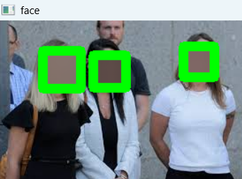

## 🎭 Face Anonymizer (Image, Video & Webcam)

A computer vision based face anonymization system that detects and hides
human faces to protect identity and privacy.

The system supports images, videos, and real-time webcam streams, making it suitable for surveillance privacy, media processing, and dataset anonymization.

## 🚀 Features

Face detection using computer vision

Face anonymization (blur / pixelation)

Works on:

🖼 Images

🎥 Video files

📷 Live webcam feed

Handles multiple faces simultaneously

Real-time processing

## 🧠 Technologies Used

Python

OpenCV

NumPy

Computer Vision

## ⚙️ Setup Instructions
1️⃣ Clone the repository
git clone https://github.com/your-username/face-anonymizer.git
cd face-anonymizer
2️⃣ Install dependencies
pip install -r requirements.txt
▶️ Usage

🖼 Process Image
python main.py --mode image --file_path images/test.jpg
🎥 Process Video
python main.py --mode video --file_path videos/sample.mp4
📷 Real-time Webcam Anonymization
python main.py --mode webcam

## 📸 Sample Predictions

Single:

Multiple:

